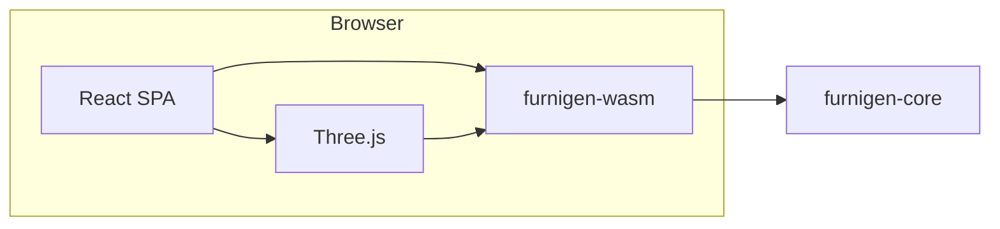

# FurniGen

Parametric **straight-run wardrobe** design: a **Rust** domain core, a **WebAssembly** boundary for the browser, and a **React + TypeScript + Vite + Three.js** preview. Canonical units are **millimeters** end to end (JSON, Rust, geometry); the UI may display inches with explicit conversion at the boundary.

## Table of contents

- [Features and roadmap](#features-and-roadmap)
- [Architecture](#architecture)
- [Prerequisites](#prerequisites)
- [Quick start](#quick-start)
- [Repository layout](#repository-layout)
- [Development](#development)
- [Testing and CI](#testing-and-ci)
- [Technical decisions](#technical-decisions)
- [Contributing](#contributing)
- [License and dependency compliance](#license-and-dependency-compliance)

## Features and roadmap

| Area | Status |
|------|--------|
| Wardrobe spec, validation, JSON contract | In progress / evolving |
| WASM mesh generation + Three.js preview | In progress / evolving |
| Cut list / BOM export | Planned (see [ADR 0005](docs/decisions/0005-export-roadmap-phase-order.md)) |
| 2D panel outlines (SVG/DXF) | Planned |
| 3D mesh export (OBJ/glTF) | Planned |
| L-shape, U-shape, 45° corners | Later milestone; schema reserves extension points |

Export sequencing after preview is documented in [`docs/decisions/0005-export-roadmap-phase-order.md`](docs/decisions/0005-export-roadmap-phase-order.md): **BOM → 2D → mesh**, aligned on a shared panel list where applicable.

## Architecture



- **`furnigen-core`**: Wardrobe spec types, validation, panel/BOM-oriented structures, pure geometry. No Three.js inside Rust.
- **`furnigen-wasm`**: Thin `wasm-bindgen` surface; JSON (or bytes) in, mesh and metadata out for the web app.
- **`web/`**: SPA that loads the WASM bundle built by **wasm-pack** (web target) into `web/src/wasm/furnigen-wasm/`.

An optional small **Rust HTTP API** later can share `furnigen-core` for heavy exports, jobs, or persistence; that is not required for the current browser-first flow.

## Prerequisites

- **Rust**: stable toolchain (`rustfmt` and `clippy` match CI expectations).
- **WebAssembly target**: `rustup target add wasm32-unknown-unknown`
- **Node.js**: **22.x** (matches CI); npm ships with Node.
- **wasm-pack**: available on your `PATH` when invoking web scripts (the `web` package lists `wasm-pack` as a devDependency so `npm ci` inside `web/` installs a local copy used by npm scripts).

## Quick start

```bash
git clone <repository-url>
cd FurniGen
rustup target add wasm32-unknown-unknown

cd web
npm ci
npm run dev
```

`predev` builds the WASM crate in **dev** mode; the app is served by Vite (default URL shown in the terminal).

For a **production** web build:

```bash
cd web
npm ci
npm run build
npm run preview   # optional: serve the production bundle locally
```

## Repository layout

| Path | Role |
|------|------|
| [`Cargo.toml`](Cargo.toml) | Rust workspace: `furnigen-core`, `furnigen-wasm` |
| [`furnigen-core/`](furnigen-core/) | Domain types, validation, geometry |
| [`furnigen-wasm/`](furnigen-wasm/) | WASM crate (`wasm-bindgen`, wasm-pack **web** target) |
| [`web/`](web/) | React + Vite + Tailwind + Three.js + Vitest + Playwright |
| [`spec-fixtures/`](spec-fixtures/) | Shared JSON fixtures for spec round-trips and tests |
| [`docs/decisions/`](docs/decisions/) | Architecture decision records (ADRs) |
| [`.github/workflows/ci.yml`](.github/workflows/ci.yml) | CI: Rust fmt/clippy/test + web test/typecheck/E2E |

Root [`package.json`](package.json) orchestrates **Rust + web** checks from the repository root.

## Development

- **Stack and invariants** (units, geometry scope, licensing intent): [`.cursor/rules/furnigen-project-context.mdc`](.cursor/rules/furnigen-project-context.mdc) and project skill [`.cursor/skills/furnigen-stack/SKILL.md`](.cursor/skills/furnigen-stack/SKILL.md).
- **WASM rebuild**: `npm run wasm:build` (release) or `npm run wasm:build:dev` from `web/`; `predev` / `prebuild` / `pretest` hook these automatically where configured.
- **`furnigen-wasm` optional feature** `debug-panic-hook`: clearer console panics during WASM development; keep release bundles lean by not enabling it in production pipelines unless you intend to.

## Testing and CI

| Layer | Command | Notes |
|-------|---------|--------|
| Rust (workspace) | `cargo test --workspace` | Geometry and core invariants |
| Rust lint | `cargo fmt --all -- --check` and `cargo clippy --workspace --all-targets -- -D warnings` | Same as CI |
| Web unit | `npm --prefix web run test` | Vitest; `pretest` builds WASM |
| Web typecheck | `npm --prefix web run typecheck` | TypeScript |
| Web E2E | `npm --prefix web run test:e2e` | Playwright (Chromium); builds WASM + production bundle first |

**Full local CI parity** (from repo root):

```bash
npm run ci
```

That runs Rust fmt, clippy, tests, then `web`’s `npm run ci` (Vitest, typecheck, Playwright).

GitHub Actions runs on **push** to `main`/`master` and on **pull requests**: see [`.github/workflows/ci.yml`](.github/workflows/ci.yml).

## Technical decisions

Non-trivial choices (schema, export order, WASM packaging, CI baseline) live under [`docs/decisions/`](docs/decisions/) with an index in [`docs/decisions/README.md`](docs/decisions/README.md). Agents and contributors should record new decisions there when they change durable architecture (see [`.cursor/rules/technical-decision-log.mdc`](.cursor/rules/technical-decision-log.mdc)).

## Contributing

- Read [`AGENTS.md`](AGENTS.md) for agent workflow pointers (decision log, confirmation before large design shifts).
- Prefer **test-first** changes where behavior is user-visible or geometry-critical: `cargo test`, Vitest, and Playwright where cost-effective.
- **Commits**: follow [Conventional Commits](https://www.conventionalcommits.org/) (see [`.cursor/rules/git-conventional-commits.mdc`](.cursor/rules/git-conventional-commits.mdc)).

## License and dependency compliance

FurniGen is licensed under **GNU General Public License v3.0 or later** (`GPL-3.0-or-later`). The full text is in [`LICENSE`](LICENSE). Project-level copyright and warranty disclaimer boilerplate is in [`COPYRIGHT`](COPYRIGHT); individual files may carry their own SPDX or copyright lines.

The distributed whole is meant to remain GPL-compatible. When adding **Rust crates** or **npm packages**, prefer licenses that combine cleanly with GPLv3 (for example MIT, Apache-2.0, and ISC are commonly acceptable; some licenses are not—verify before merging). Planned hardening includes **Rust** license/advisory checks (for example [`cargo-deny`](https://embarkstudios.github.io/cargo-deny/)) and **JavaScript** license scanning in CI; wire those when the dependency surface stabilizes.

If you later ship a **networked server** with extra features, evaluate whether **AGPLv3** (or a split license) matches distribution intent; that remains an optional follow-up ADR.
